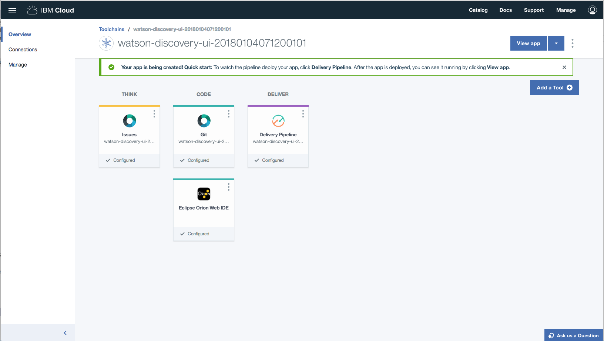
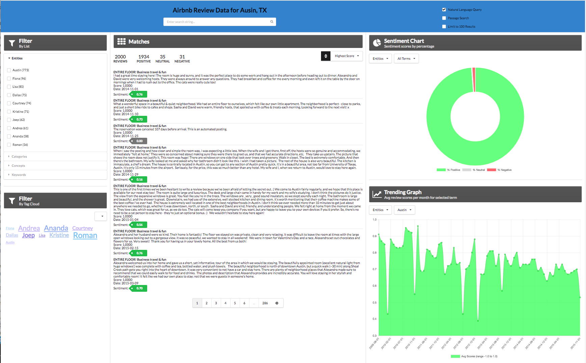

[](https://travis-ci.org/IBM/watson-discovery-ui)

*阅读本文的其他语言版本：[English](README.md)。*

# 开发一个构建于 Watson Discovery Service 之上的全功能 Web 应用程序

在本 Code Pattern 中，我们将演示一个 Web 应用程序的实用示例，该应用程序对来自 Watson Discovery Service 的数据进行查询和处理。此 Web 应用程序包含多个 UI 组件，您可以使用这些组件来开发您自己的 Watson Discovery Service 应用程序。 

使用 Watson Discovery Service 的主要优势是它的强大分析引擎对您的数据进行了认知数据充实并提供了洞察。此应用程序提供了如何通过使用过滤器、列表和图表来展示这些数据充实的示例。我们将重点介绍的关键数据充实包括：

* 实体 - 人员、公司、组织、城市等。
* 类别 - 将数据分类到一个最高可达 5 级的分层结构中。
* 概念 - 已识别的一般概念，不一定会在数据中引用
* 关键词 - 通常用于建立索引或搜索数据的重要主题
* 情感 - 每个文档的整体正面或负面情感

对于本 Code Pattern，我们将使用位于得克萨斯州奥斯汀的 Airbnb 资产的评价数据。 

读者完成本 Code Pattern 后，将会掌握如何：
* 在 Watson Discovery Service 中加载并充实数据。
* 在 Watson Discovery Service 中查询并处理数据。
* 创建 UI 组件来表示 Watson Discovery Service 创建的经过充实的数据。
* 构建一个完整的 Web 应用程序，该应用程序利用流行的 JavaScript 技术来描绘 Watson Discovery Service 数据和数据充实。


## 操作流程
1. 将 Airbnb 评价 JSON 文件添加到 Discovery 集合中。
2. 用户通过应用程序 UI 与后端服务器进行交互。前端应用程序 UI 使用 React 呈现搜索结果，并且可以重用后端用于服务器端呈现的所有视图。前端使用了 semantic-ui-react 组件，而且是响应式的。
3. 处理用户输入并将其路由到后端服务器，后者负责在服务器端呈现将在浏览器上显示的视图。后端服务器是使用 Express 编写的，使用了一个 express-react-views 引擎来呈现使用 React 编写的视图。
4. 后端服务器将用户请求发送到 Watson Discovery Service。它充当代理服务器，将查询从前端转发到 Watson Discovery Service API，同时保持对用户隐藏敏感 API 密钥。

## UI 控件和关联操作

这是主要 UI 屏幕的粗略框架，后面是一段对每个 UI 组件及相关操作的描述：


1. 搜索字段和搜索参数：根据搜索条件来返回结果。搜索参数将影响用户如何输入值，这些值将如何显示，并限制所列出的匹配项数量。
2. 列表过滤器：应用到搜索结果的多个过滤器下拉列表。每个下拉列表都包含与结果有关的实体、类别、概念和关键词。对于每个下拉过滤器项，还将显示匹配项数量。如果用户选择一个过滤器项，那么将执行一次新搜索并更新结果面板 (#3)。选择的过滤器项还将影响标记云中显示的结果 (#4)。
3. 搜索结果和页码菜单：显示一页结果（比如每页 5 个）和一个页码菜单，以便允许用户滚动浏览各页结果。还有一个下拉菜单，以便允许用户根据日期、分数和情感值对条目进行排序。
4. 标记云过滤器：类似于列表过滤器 (#2)，但具有不同格式。一次可以显示一组过滤器项（实体、类别、概念或关键词）。用户可以选择/取消选择云中的各项来打开/关闭过滤器。在两种过滤器视图（#2 和 #4）应用的过滤器始终会同步。
5. 趋势图：此图表显示某个特定实体、类别、概念或关键词的情感变化趋势。该数据将反映当前匹配的结果集。
6. 情感图：显示选定实体、类别、概念或关键词的正面、中立和负面评价的总百分比的环形图。该数据将反映当前匹配的结果集。

> 备注：参阅 [DEVELOPING.md](DEVELOPING.md) 了解项目结构。

## 包含的组件
* [Watson Discovery](https://www.ibm.com/watson/developercloud/discovery.html): 一个认知搜索和内容分析引擎，供应用程序用来识别模式、趋势和可行性洞察。

## 精选技术
* [Node.js](https://nodejs.org/)：一个用于执行服务器端 JavaScript 代码的开源 JavaScript 运行时环境。
* [React](https://facebook.github.io/react/)：一个用来构建用户界面的 JavaScript 库。
* [Express](https://expressjs.com) - 一个创建 API 和 Web 服务器的流行的、极为简化的 Web 框架。
* [Semantic UI React](https://react.semantic-ui.com/introduction)：Semantic UI 组件的 React 集成。 
* [Chart.js](http://www.chartjs.org/)：JavaScript 图表包。
* [Jest](https://facebook.github.io/jest/)：一个 JavaScript 测试框架。

# 观看视频

[](http://v.youku.com/v_show/id_XMzU3MDg1NDY2MA==.html)

# 步骤

使用 ``Deploy to IBM Cloud`` 按钮**或**在本地创建服务并运行。

## 部署到 IBM Cloud

[](https://bluemix.net/deploy?repository=https://github.com/IBM/watson-discovery-ui.git)

1.按下上面的 ``Deploy to IBM Cloud`` 按钮，然后单击 ``Deploy``。

2.在 Toolchains 中，单击 Delivery Pipeline 来观看应用程序部署流程。完成部署后，可通过单击 `View app` 来查看该应用程序。



3.要查看为 Code Pattern 创建和配置的应用程序和服务，可以使用 IBM Cloud 仪表板。此应用程序命名为 `watson-discovery-ui`（含有独特后缀）。可使用 `wdui-` 前缀来创建并轻松识别以下服务：
    * wdui-discovery-service

## 在本地运行
> 备注：只有在本地运行（而不是使用 ``Deploy to IBM Cloud`` 按钮）时，才需要执行这些步骤。

1. [克隆存储库](#1-clone-the-repo)
2. [创建 IBM Cloud 服务](#2-create-ibm-cloud-services)
3. [加载 Discovery 文件](#3-load-the-discovery-files)
4. [配置凭证](#4-configure-credentials)
5. [运行应用程序](#5-run-the-application)

### 1.克隆存储库
```
$ git clone https://github.com/IBM/watson-discovery-ui
```

### 2.创建 IBM Cloud 服务

创建以下服务：

* [**Watson Discovery**](https://console.ng.bluemix.net/catalog/services/discovery)

### 3.加载 Discovery 文件

启动 **Watson Discovery** 工具。创建**新数据集合**
并为该数据集合提供一个唯一名称。

<p align="center">
  
</p>

在新集合数据面板的 `Configuration` 下，单击 `Switch` 按钮创建一个新配置文件，该文件将包含提取关键词作为数据充实函数。为配置文件提供一个唯一名称。


> 备注：这一步失败会导致应用程序中没有显示任何 `keywords`。 

在新集合数据面板的 `Add data to this collection` 下，使用 `Drag and drop your documents here or browse from computer` 向内容中注入从 `data/airbnb/` 提取的 JSON 文件。


> 保存 **environment_id** 和 **collection_id**，供下一步中的 `.env` 文件使用。

### 4.配置凭证
```
cp env.sample .env
```
采用必要设置来编辑 `.env` 文件。

#### `env.sample:`

```
# Replace the credentials here with your own.
# Rename this file to .env before starting the app.

# Watson Discovery
DISCOVERY_USERNAME=<add_discovery_username>
DISCOVERY_PASSWORD=<add_discovery_password>
DISCOVERY_ENVIRONMENT_ID=<add_discovery_environment>
DISCOVERY_COLLECTION_ID=<add_discovery_collection>

# Run locally on a non-default port (default is 3000)
# PORT=3000

```

### 5.运行应用程序
1. 安装 [Node.js](https://nodejs.org/en/) 运行时或 NPM。
1. 通过运行 `npm install`，然后运行 `npm start`，来启动应用程序。
1. 通过在浏览器中访问 `localhost:3000` 来访问 UI。
> 备注：可根据需要在 app.js 中更改服务器主机，可在 `.env` 中设置 `PORT`。

# 样本 UI 布局
 


# 故障排除

* 错误：环境 {GUID} 尚未处于激活状态，请在状态激活后重试

  > 这是首次运行期间常见的错误。应用程序尝试在完全创建 Discovery 
环境之前启动。请稍等一两分钟。此环境重新启动后
应可供使用。如果使用了 `Deploy to IBM Cloud`，则会自动重新启动。

* 错误：每个组织仅允许使用一个免费环境

  > 要使用免费试用版，请创建一个小型的免费 Discovery 环境。如果您已有一个 Discovery 环境，创建将会失败。如果您没有使用 Discovery，可以检查一个您可能想删除的旧服务。否则，使用 .env DISCOVERY_ENVIRONMENT_ID 告诉应用程序您希望它使用的环境。将在此环境中使用默认配置创建一个集合。

* 将数据加载到 Discovery 中时出错

  > 一次将所有 2000 个文档文件加载到 Discovery 中有时可能导致“繁忙”错误。如果出现此错误，可以重新开始并一次加载少量文件。

* 应用程序中没有出现关键词

  > 这可能是由于没有为您的数据集合分配合适的配置文件。参阅上面的[第 3 步](#3-load-the-discovery-files)。


# 链接

* [优酷上的演示](http://v.youku.com/v_show/id_XMzU3MDg1NDY2MA==.html)：观看视频
* [Watson Node.js SDK](https://github.com/watson-developer-cloud/node-sdk): 下载 Watson Node SDK。

# 了解更多信息

* **人工智能 Code Pattern**：喜欢本 Code Pattern 吗？了解我们的其他 [AI Code Pattern](https://developer.ibm.com/cn/technologies/artificial-intelligence/)。
* **AI 和数据 Code Pattern 播放清单**：收藏包含我们所有 Code Pattern 视频的[播放清单](http://i.youku.com/i/UNTI2NTA2NTAw/videos?spm=a2hzp.8244740.0.0)
* **With Watson**：想要进一步改进您的 Watson 应用程序？正在考虑使用 Watson 品牌资产？[加入 With Watson 计划](https://www.ibm.com/watson/with-watson/)，以便利用独家品牌、营销和技术资源来增强和加速您的 Watson 嵌入式商业解决方案。

# 许可
[Apache 2.0](LICENSE)
