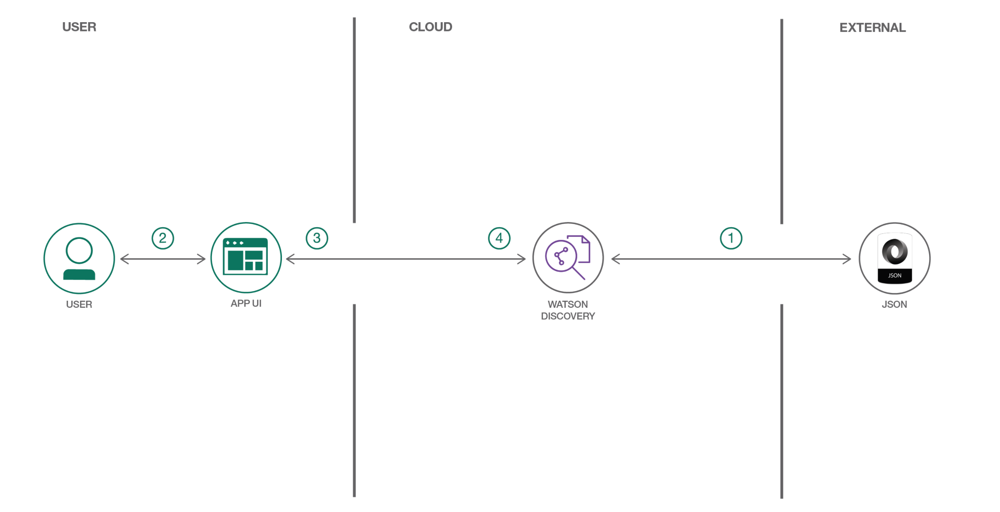
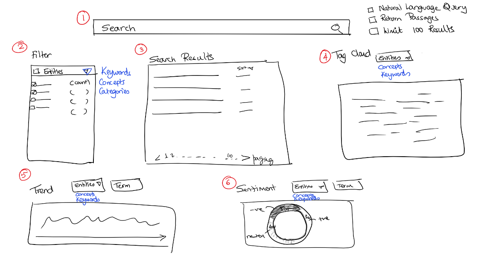

*他の言語で読む: [English](README.md), [中国語](README-cn.md).*

[](https://travis-ci.org/IBM/watson-discovery-ui)

# Watson Discovery Serviceで構築されたフル機能のWebアプリケーションを開発する

このコードパターンでは、Watson Discovery Serviceのデータを照会して操作するWebアプリケーションの実例を紹介します。 このWebアプリケーションには、独自のWatson Discovery Serviceアプリケーションを開発するための出発点として使用できる複数のUIコンポーネントが含まれています。

Watson Discovery Service を利用する最大の利点は、コグニティブ・エンリッチを適用してデータから洞察を引き出す、その強力なアナリティクス・エンジンにあります。このコード・パターンのアプリでは、Watson Discovery Service アナリティクス・エンジンのエンリッチ機能を、フィルター、リスト、グラフを使用して提示する例を説明します。データには主に以下のエンリッチが適用されます。

* エンティティー: 人、企業、組織、都市など
* カテゴリー: 深さ最大 5 レベルのカテゴリー階層にデータを分類
* 概念: 必ずしもデータ内で参照されていない一般概念を識別
* キーワード: データのインデックスや検索で通常使用される重要なトピック
* 感情: 各ドキュメントの全体的な感情 (肯定的または否定的)

このコードパターンでは、テキサス州オースティンにあるAirbnb宿泊施設のレビューを含むデータを使用します。

このコード・パターンをひと通り完了すると、以下の方法がわかるようになります。

* Watson Discovery Service にデータをロードしてエンリッチする
* Watson Discovery Service 内でデータのクエリーを実行し、データを処理する
* Watson Discovery Service によってエンリッチされたデータを示す UI コンポーネントを作成する
* よく使われている JavaScript テクノロジーを使用して、Watson Discovery Service のデータとエンリッチを備えた完全な Web アプリを構築する



## Flow
1. Airbnb レビューの JSON ファイルを Discovery コレクションに追加します。
2. アプリの UI を使用してバックエンド・サーバーとやり取りします。フロントエンドのアプリ UI が React を使用して検索結果をレンダリングします。この UI は、バックエンドで使用したすべてのビューを再利用してサーバー・サイドのレンダリングを行うことができます。フロントエンドは semantic-ui-react コンポーネントを使用していて、レスポンシブなものとなっています。
3. Discovery が入力を処理してバックエンド・サーバーにルーティングします。バックエンド・サーバーの役目は、ブラウザーに表示するビューをレンダリングすることです。バックエンド・サーバーは Express を使用して作成されており、React で作成されたビューを、express-react-views エンジンを使用してレンダリングします。
4. バックエンド・サーバーがユーザー・リクエストを Watson Discovery Service に送信します。バックエンド・サーバーはプロキシー・サーバーとして機能し、フロントエンドからのクエリーを Watson Discovery Service API に転送する一方で、機密性の高い API キーをユーザーから隠します。

## UI制御と関連するアクション

ここでは、メインのUI画面の概略を示し、その後に各UIコンポーネントとそれに関連するアクションを説明します。



1. 検索フィールドと検索パラメータ: 検索条件に基づいて結果を返します。 検索パラメータは、ユーザーが値を入力する方法、表示方法、一致数を制限するために使用されます。
2. リストフィルタ: 検索結果に適用されるフィルタの複数のドロップダウンリスト。 各ドロップダウンリストには、結果に関連するエンティティ、カテゴリ、概念、およびキーワードが含まれています。 ドロップダウンフィルター項目ごとに、一致数も表示されます。 ユーザーがフィルタ項目を選択すると、新しい検索が実行され、検索結果パネル(#3)が更新されます。 選択したフィルタ項目は、タグクラウド(#4)に表示される内容にも影響します。
3. 検索結果とページ区切りメニュー: 結果項目のページ（ページあたり5個など）と、結果項目のページをスクロールできるペー区切りメニューが表示されます。 ドロップダウンメニューもあり、ユーザーは日付、スコア、および感情値に基づいてエントリを並べ替えることができます。
4. タグクラウド・フィルタ：リストフィルタ (#2) に似ていますが、異なる形式です。一セットのフィルタ項目(エンティティ、カテゴリ、概念またはキーワードのいずれか)を一度に表示できます。 ユーザーは、クラウド内の項目を選択/選択解除してフィルターをオン/オフすることができます。 両方のフィルタ表示(#2と#4)で適用されたフィルタは常に同期します。
5. トレンドチャート: 特定のエンティティ、カテゴリ、コンセプト、またはキーワードに対する感情傾向を時間の経過とともに示すグラフ。データには現在の検索結果が反映されます。
6. 感情チャート: 選択したエンティティ、カテゴリ、コンセプトまたはキーワードの中立的、否定的なレビューの合計割合を示すドーナツチャート。データには現在の検索結果が反映されます。

> 注: プロジェクト構造については、 [DEVELOPING.md](DEVELOPING.md) を参照してください。

## 含まれるコンポーネント

* [Watson Discovery](https://www.ibm.com/watson/jp-ja/developercloud/discovery.html): 大量のデータを検索するとともに、データからパターンや傾向を読み取り、適切な意思決定を支援します。

## 利用した技術

* [Node.js](https://nodejs.org/ja/): サーバー側のJavaScriptコードを実行するためのオープンソースのJavaScriptランタイム環境。
* [React](https://facebook.github.io/react/): ユーザーインターフェイスを構築するためのJavaScriptライブラリ。
* [Express](https://expressjs.com): APIとWebサーバーを作成するための一般的で最小限のWebフレームワーク。
* [Semantic UI React](https://react.semantic-ui.com/introduction): セマンティックUIコンポーネントためのReact実装。
* [Chart.js](http://www.chartjs.org/): チャート用のJavaScriptパッケージ。
* [Jest](https://facebook.github.io/jest/): JavaScript用のテストフレームワーク。

# ビデオを観る

[](https://youtu.be/5EEmQwcjUa4)

# 手順

``Deploy to IBM Cloud`` ボタンを使用するか、サービスを作成してローカルで実行してください。

## IBM Cloudへのデプロイ

[](https://bluemix.net/deploy?repository=https://github.com/IBM/watson-discovery-ui.git)

1. 上の `Deploy to IBM Cloud` ボタンを押し、`Deploy` をクリックします。

2. ツールチェーンでは、`配信パイプライン(Delivery Pipeline)` をクリックして、アプリケーションをデプロイします。 いったんデプロイされると、`アプリを表示(View App)` をクリックすることでアプリを表示できます。


3. 作成および設定されたアプリケーションとサービスを確認するには、IBM Cloudダッシュボードを使用します。アプリケーション名は、固有の接尾辞を持つ `watson-discovery-ui` です。以下のサービスが作成され、`wdui-` 接頭辞によって簡単に見つけることができます。
    * wdui-discovery-service

## ローカルで実行する

> 注: これらの手順は `Deploy to IBM Cloud` ボタンを使用する代わりに、ローカルで実行する場合にのみ必要です

1. [リポジトリーを複製する](#1-clone-the-repo)
2. [IBM Cloudサービスを作成する](#2-create-ibm-cloud-services)
3. [Discoveryファイルをロードする](#3-load-the-discovery-files)
4. [資格情報を構成する](#4-configure-credentials)
5. [アプリケーションを実行する](#5-run-the-application)

<a name="1-clone-the-repo"></a>
### 1. リポジトリーを複製する
```
$ git clone https://github.com/IBM/watson-discovery-ui
```

<a name="2-create-ibm-cloud-services"></a>
### 2. IBM Cloudサービスを作成する

以下のサービスを作成する:

* [**Watson Discovery**](https://console.ng.bluemix.net/catalog/services/discovery)

<a name="3-load-the-discovery-files"></a>
### 3. Discoveryファイルをロードする


**Watson Discovery** ツールを起動します。 **新しい data collection** を作成し、ユニークな名前を付けます。

<p align="center">
  
</p>

新しいコレクションのデータパネルの `Configuration` の下にある `Switch` ボタンをクリックして、データをエンリッチメントするためキーワードを抽出する新しい設定ファイルを作成します。この設定ファイルにユニークな名前を付けます。


> 注: これを行わないと、アプリに `keywords` が表示されなくなります。

新しいコレクションのデータパネルの `Add data to this collection` の下の `Drag and drop your documents here or browse from computer` を使用して、`data/airbnb/` から抽出したjsonファイルを読み込ませます。


> 次のステップで `.env` ファイルに **environment_id** と **collection_id** を保存します。

<a name="4-configure-credentials"></a>
### 4. 資格情報を構成する
```
cp env.sample .env
```

`.env`ファイルを編集して必要な設定をします。

#### `env.sample:`

```
# Replace the credentials here with your own.
# Rename this file to .env before starting the app.

# Watson Discovery
DISCOVERY_USERNAME=<add_discovery_username>
DISCOVERY_PASSWORD=<add_discovery_password>
DISCOVERY_ENVIRONMENT_ID=<add_discovery_environment>
DISCOVERY_COLLECTION_ID=<add_discovery_collection>

# Run locally on a non-default port (default is 3000)
# PORT=3000

```

<a name="5-run-the-application"></a>
### 5. アプリケーションを実行する

1. [Node.js](https://nodejs.org/ja/) ランタイムと NPM をインストールします。
2. アプリを起動するため `npm install` と `npm start` を実行します。
3. ブラウザに `localhost：3000` を指定してUIにアクセスしてください。

> 注: 必要に応じてサーバーホストはapp.js内で変更でき、`PORT` は `.env` ファイルで設定することができます。

# サンプル UI レイアウト


# トラブルシューティング

* Error: Environment {GUID} is still not active, retry once status is active

  > これは、最初の実行時に起こりがちです。Discovery環境が完全に作成される前にアプリが開始しようとしました。1〜2分の時間をおいてください。その後で再起動時すれば動作します。`Deploy to IBM Cloud` を使用した場合、再起動は自動的に行われます。

* Error: Only one free environment is allowed per organization

  > 無料トライアルで作業する場合、小さな無料のディスカバリー環境が作成されます。既にDiscovery環境を使用している場合、その実行は失敗するでしょう。 Discoveryを使用していない場合は、古いサービスをどれか削除してください。それ以外の場合は .envファイルの DISCOVERY_ENVIRONMENT_ID 値を使用して、使用する環境のIDをアプリに通知します。この環境では、デフォルト構成を使用してコレクションが作成されます。

* Error when loading files into Discovery

  > 2000のドキュメントファイルをDiscoveryにすべて一度に読み込むと、「ビジー」エラーが発生することがあります。この場合には、何度かに分けてファイルを読み込んでください。

* No keywords appear in the app

  > これは、データ収集に適切な構成ファイルが割り当てられていないことが原因です。 上記の [Step 3](#3-load-the-discovery-files) を参照してください。

# リンク

* [Demo on Youtube](https://www.youtube.com/watch?v=5EEmQwcjUa4): ビデオを観る。
* [Watson Node.js SDK](https://github.com/watson-developer-cloud/node-sdk): Watson Node SDKをダウンロードする。

# もっと学ぶ

* **Artificial Intelligence コードパターン**: このコードパターンを気に入りましたか？ [AI Code コードパターン](https://developer.ibm.com/jp/technologies/artificial-intelligence/) から関連パターンを参照してください。
* **AI and Data コードパターン・プレイリスト**: コードパターンに関係するビデオ全ての [プレイリスト](https://www.youtube.com/playlist?list=PLzUbsvIyrNfknNewObx5N7uGZ5FKH0Fde) です。
* **With Watson**: [With Watson プログラム](https://www.ibm.com/watson/jp-ja/with-watson/) は、自社のアプリケーションに Watson テクノロジーを有効的に組み込んでいる開発者や企業に、ブランディング、マーケティング、テクニカルに関するリソースを提供するプログラムです。

# ライセンス
[Apache 2.0](LICENSE)
